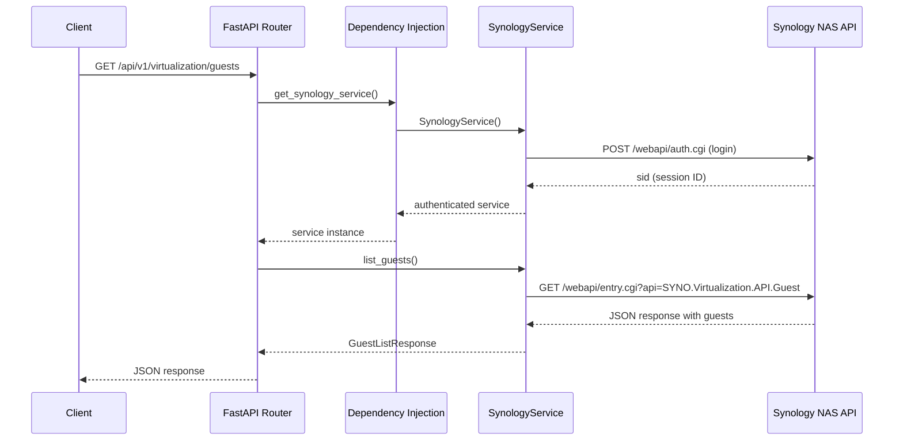

# Как работает `/api/v1/virtualization/guests`

Подробное описание потока данных при получении списка виртуальных машин из Synology NAS.

## Общая схема



## Шаг 1: HTTP запрос от клиента

Клиент отправляет GET запрос:

```bash
curl http://localhost:8000/api/v1/virtualization/guests
```

FastAPI маршрутизирует запрос в файл `api/v1/virtualization.py`:

```python
# api/v1/virtualization.py

@router.get("/guests", response_model=GuestListResponse, status_code=status.HTTP_200_OK)
async def list_guests(
    service: SynologyService = SynologyServiceDep,  # <-- Dependency Injection
) -> GuestListResponse:
    """List all virtual machines."""
    return await service.list_guests()
```

**Что происходит:**
- `@router.get("/guests")` - регистрирует endpoint
- `response_model=GuestListResponse` - FastAPI автоматически валидирует и сериализует ответ
- `SynologyServiceDep` - это dependency, который создает и настраивает сервис

---

## Шаг 2: Dependency Injection

`SynologyServiceDep` определен в `core/deps.py`:

```python
# core/deps.py

async def get_synology_service() -> AsyncGenerator[SynologyService, None]:
    """Dependency to get an authenticated Synology service instance."""
    service = SynologyService()  # Создаем экземпляр сервиса
    
    try:
        async with service:  # Используем context manager
            await service._ensure_authenticated()  # Авторизуемся
            yield service  # Возвращаем готовый сервис
    except Exception as e:
        raise HTTPException(
            status_code=status.HTTP_503_SERVICE_UNAVAILABLE,
            detail=f"Failed to connect to Synology NAS: {str(e)}"
        )

# Алиас для удобства
SynologyServiceDep = Depends(get_synology_service)
```

**Что происходит:**
1. Создается новый экземпляр `SynologyService`
2. Вызывается `__aenter__` (context manager) - инициализируется HTTP клиент
3. Вызывается `_ensure_authenticated()` - проверяется/создается сессия
4. Готовый сервис передается в endpoint функцию

---

## Шаг 3: Инициализация SynologyService

```python
# service/synology_service.py

class SynologyService:
    def __init__(self):
        # Загружаем настройки из .env через core/config.py
        self.base_url = settings.SYNOLOGY_URL.rstrip('/')  # https://192.168.1.100:5001
        self.username = settings.SYNOLOGY_USER             # admin
        self.password = settings.SYNOLOGY_PASSWORD         # ****
        self.verify_ssl = settings.SYNOLOGY_VERIFY_SSL     # False
        self.session_timeout = settings.SYNOLOGY_SESSION_TIMEOUT  # 3600
        
        # Состояние сессии
        self._sid: Optional[str] = None           # Session ID от Synology
        self._session_expires: Optional[datetime] = None
        self._client: Optional[httpx.AsyncClient] = None
```

**Настройки загружаются из:**

```python
# core/config.py

class Settings(BaseSettings):
    SYNOLOGY_URL: str          # Из .env: SYNOLOGY_URL=https://192.168.1.100:5001
    SYNOLOGY_USER: str         # Из .env: SYNOLOGY_USER=admin
    SYNOLOGY_PASSWORD: str     # Из .env: SYNOLOGY_PASSWORD=****
    SYNOLOGY_VERIFY_SSL: bool = False
    SYNOLOGY_SESSION_TIMEOUT: int = 3600
    
    class Config:
        env_file = ".env"
```

---

## Шаг 4: Авторизация в Synology NAS

Метод `_ensure_authenticated()` проверяет, есть ли активная сессия:

```python
async def _ensure_authenticated(self):
    """Ensure we have a valid session, login if needed."""
    if not self._is_session_valid():
        await self.login()

def _is_session_valid(self) -> bool:
    """Check if current session is valid."""
    return (
        self._sid is not None 
        and self._session_expires is not None 
        and datetime.now() < self._session_expires
    )
```

Если сессии нет или она истекла, вызывается `login()`:

```python
async def login(self, account: Optional[str] = None, passwd: Optional[str] = None) -> LoginResponse:
    """Login to Synology NAS."""
    params = {
        "api": "SYNO.API.Auth",
        "version": "3",
        "method": "login",
        "account": account or self.username,
        "passwd": passwd or self.password,
        "session": "FileStation",
        "format": "sid"
    }
    
    # Отправляем запрос на /webapi/auth.cgi
    data = await self._make_request("auth.cgi", params, require_auth=False)
    
    # Сохраняем session ID
    self._sid = data.get("data", {}).get("sid")
    if self._sid:
        self._session_expires = datetime.now() + timedelta(seconds=self.session_timeout)
    
    return LoginResponse(
        success=data.get("success", False),
        data=data.get("data"),
        sid=self._sid
    )
```

**HTTP запрос к Synology:**

```
GET https://192.168.1.100:5001/webapi/auth.cgi?api=SYNO.API.Auth&version=3&method=login&account=admin&passwd=****&session=FileStation&format=sid
```

**Ответ от Synology:**

```json
{
    "success": true,
    "data": {
        "sid": "abc123xyz789..."
    }
}
```

---

## Шаг 5: Получение списка VM

После авторизации вызывается метод `list_guests()`:

```python
async def list_guests(self) -> GuestListResponse:
    """List virtual machines."""
    await self._ensure_authenticated()  # Убеждаемся что авторизованы
    
    params = {
        "api": "SYNO.Virtualization.API.Guest",
        "version": "1",
        "method": "list"
    }
    
    data = await self._make_request("entry.cgi", params)
    guests_data = data.get("data", {}).get("guests", [])
    
    return GuestListResponse(
        guests=guests_data,
        offset=0,
        total=len(guests_data)
    )
```

---

## Шаг 6: HTTP запрос к Synology Virtualization API

Метод `_make_request()` формирует и отправляет запрос:

```python
async def _make_request(
    self, 
    endpoint: str,      # "entry.cgi"
    params: Dict[str, Any],
    require_auth: bool = True
) -> Dict[str, Any]:
    """Make HTTP request to Synology API."""
    client = await self._ensure_client()
    url = f"{self.base_url}/webapi/{endpoint}"
    
    # Добавляем session ID для авторизованных запросов
    if require_auth and self._sid:
        params["_sid"] = self._sid
    
    try:
        response = await client.get(url, params=params)
        response.raise_for_status()
        data = response.json()
        
        # Проверяем успешность
        if not data.get("success", False):
            error_info = data.get("error", {})
            raise HTTPException(...)
        
        return data
        
    except httpx.HTTPError as e:
        raise HTTPException(status_code=503, detail=f"Failed to connect: {e}")
```

**Итоговый HTTP запрос:**

```
GET https://192.168.1.100:5001/webapi/entry.cgi?api=SYNO.Virtualization.API.Guest&version=1&method=list&_sid=abc123xyz789...
```

**Ответ от Synology:**

```json
{
    "success": true,
    "data": {
        "guests": [
            {
                "guest_id": "550e8400-e29b-41d4-a716-446655440001",
                "guest_name": "Ubuntu Server",
                "status": "running",
                "autorun": 1,
                "vcpu_num": 2,
                "vram_size": 4096,
                "description": "Web server"
            },
            {
                "guest_id": "550e8400-e29b-41d4-a716-446655440002",
                "guest_name": "Windows 11",
                "status": "stopped",
                "autorun": 0,
                "vcpu_num": 4,
                "vram_size": 8192,
                "description": "Development"
            }
        ]
    }
}
```

---

## Шаг 7: Преобразование в Pydantic модель

Данные преобразуются в `GuestListResponse`:

```python
# schema/synology.py

class GuestInfo(BaseModel):
    """Virtual machine guest information."""
    guest_id: str = Field(..., alias="guest_id")
    guest_name: str = Field(..., alias="guest_name")
    status: str  # running, stopped, paused, etc.
    autorun: Optional[int] = None
    vcpu_num: Optional[int] = None
    vram_size: Optional[int] = None
    description: Optional[str] = None
    storage_id: Optional[str] = None
    
    class Config:
        populate_by_name = True


class GuestListResponse(BaseModel):
    """List of virtual machines."""
    guests: List[GuestInfo]
    offset: int = 0
    total: int = 0
```

**Что делает Pydantic:**
1. Валидирует типы данных
2. Применяет значения по умолчанию для отсутствующих полей
3. Преобразует данные в Python объекты

---

## Шаг 8: Ответ клиенту

FastAPI автоматически сериализует `GuestListResponse` в JSON:

```json
{
    "guests": [
        {
            "guest_id": "550e8400-e29b-41d4-a716-446655440001",
            "guest_name": "Ubuntu Server",
            "status": "running",
            "autorun": 1,
            "vcpu_num": 2,
            "vram_size": 4096,
            "description": "Web server",
            "storage_id": null
        },
        {
            "guest_id": "550e8400-e29b-41d4-a716-446655440002",
            "guest_name": "Windows 11",
            "status": "stopped",
            "autorun": 0,
            "vcpu_num": 4,
            "vram_size": 8192,
            "description": "Development",
            "storage_id": null
        }
    ],
    "offset": 0,
    "total": 2
}
```

---

## Полная цепочка вызовов

```
Client Request
    │
    ▼
┌─────────────────────────────────────────────────────────────┐
│  FastAPI Router (api/v1/virtualization.py)                  │
│  @router.get("/guests")                                     │
│  async def list_guests(service: SynologyService = ...)      │
└─────────────────────────────────────────────────────────────┘
    │
    ▼
┌─────────────────────────────────────────────────────────────┐
│  Dependency Injection (core/deps.py)                        │
│  get_synology_service()                                     │
│  - Создает SynologyService                                  │
│  - Вызывает _ensure_authenticated()                         │
└─────────────────────────────────────────────────────────────┘
    │
    ▼
┌─────────────────────────────────────────────────────────────┐
│  SynologyService.login() (service/synology_service.py)      │
│  - POST /webapi/auth.cgi                                    │
│  - api=SYNO.API.Auth&method=login                           │
│  - Получает sid                                             │
└─────────────────────────────────────────────────────────────┘
    │
    ▼
┌─────────────────────────────────────────────────────────────┐
│  SynologyService.list_guests()                              │
│  - GET /webapi/entry.cgi                                    │
│  - api=SYNO.Virtualization.API.Guest&method=list&_sid=...   │
│  - Получает список VM                                       │
└─────────────────────────────────────────────────────────────┘
    │
    ▼
┌─────────────────────────────────────────────────────────────┐
│  Pydantic Validation (schema/synology.py)                   │
│  GuestListResponse                                          │
│  - Валидация данных                                         │
│  - Сериализация в JSON                                      │
└─────────────────────────────────────────────────────────────┘
    │
    ▼
Client Response (JSON)
```

---

## Обработка ошибок

### Ошибка подключения к NAS

```python
except httpx.HTTPError as e:
    raise HTTPException(
        status_code=status.HTTP_503_SERVICE_UNAVAILABLE,
        detail=f"Failed to connect to Synology NAS: {str(e)}"
    )
```

**Ответ клиенту:**
```json
{
    "success": false,
    "error": {
        "code": 503,
        "message": "Failed to connect to Synology NAS: Connection refused",
        "type": "HTTPException"
    }
}
```

### Истекшая сессия

```python
if error_code == 105:  # Session expired
    self._sid = None
    self._session_expires = None
    raise HTTPException(
        status_code=status.HTTP_401_UNAUTHORIZED,
        detail="Session expired. Please login again."
    )
```

### Ошибка Synology API

```python
if not data.get("success", False):
    error_info = data.get("error", {})
    raise HTTPException(
        status_code=status.HTTP_400_BAD_REQUEST,
        detail=f"Synology API error: {error_info}"
    )
```

---

## Файлы, участвующие в процессе

| Файл | Роль |
|------|------|
| `api/v1/virtualization.py` | HTTP endpoint, маршрутизация |
| `core/deps.py` | Dependency injection, создание сервиса |
| `core/config.py` | Загрузка настроек из .env |
| `service/synology_service.py` | HTTP клиент, бизнес-логика |
| `schema/synology.py` | Pydantic модели для валидации |
| `main.py` | Регистрация роутеров |
| `.env` | Конфигурация (URL, credentials) |
